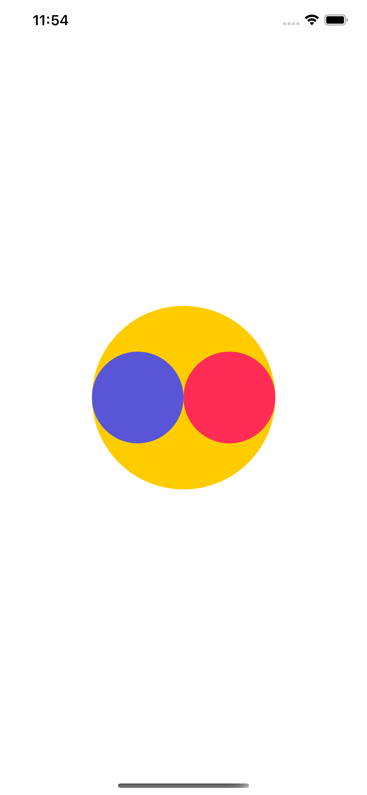

# DI Part 4 - Auto Layout Event Cycle

請實作以下 Project

1. 在畫面上顯示三個 View，分別為黃色，紅色，紫色背景
2. 黃色 View 直徑為螢幕寬度的一半，紅色 View 與紫色 View 直徑為黃色 View 的一半
3. 黃色 View 位置為圓心正對螢幕的中心
4. 請用 Auto Layout 實現
5. 請勿使用 `viewDidAppear` method

# Recap
1. When did auto layout finish calculating in UIViewController?
2. When did auto layout finish calculating in UIView?
3. Auto Layout calculate sequence